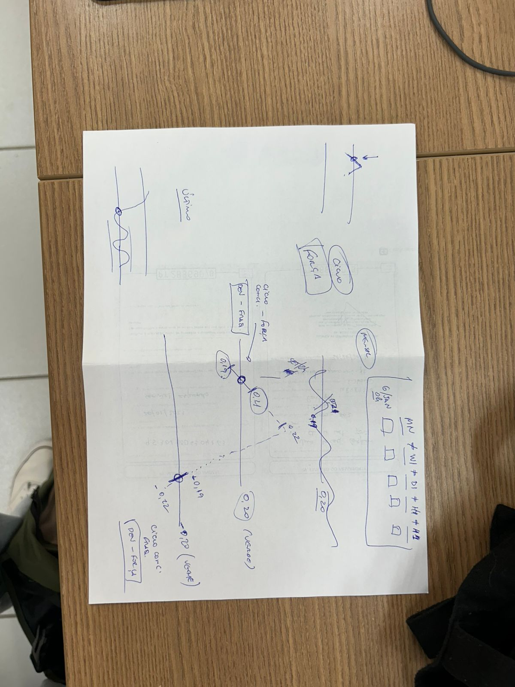

# Próximos Passos - 16/01/2026
## TO-DO ✅
- [✅] Adicionar dia da semana em Dashboard.
- [✅] Tirar do padrão 'Flutuante 21h'
- [ ] Revisar implementação das fórmulas - ex: 14/01/2026
  - H4 não esta aparecento porque?
  - era para ser força e apenas no dia 15(0h) ser fraqueza
- [ ] Rever implementação de token de acesso, quando desativado redirecionar para tela de login
- [ ] Tratamento de erro 404 quando token inválido

## Implementação das Fórmulas - Análise
- FORÇA E FRAQUEZA

### [ ] Ciclo concluido x Deve ciclo - REVER
- Explicação em imagem

- Um é o oposto do outro, ou seja, se `Ciclo Concluído = FORÇA`, então `Deve Ciclo = FRAQUEZA`.
- Por exemplo, no caso da moeda AUD:
  - Existem 2 pontos que definem a força e a fraqueza: 0.20 e -0.20.
  - Quando ultrapassa o 0.20, conclui o ciclo de força, após o próximo score.
  - Quando ultrapassa o -0.20, conclui o ciclo de fraqueza, após o próximo score.
  - Se um score passa pela linha de fraqueza, sobe sem passar pela linha de força e cai novamente para linha de fraqueza, esse segundo momento não é o ciclo concluído, o que fica armazenado ainda é o primeiro pois isso será importante para outro parâmetro posteriormente. A mesma coisa acontece com o ciclo de força.

### [✅] Flutuante
- No caso do mensal(MN), por exemplo, ele vai pegar a entrada do dia (ex: 15/01/2026) e avaliar em relação a entrada do primeiro dia do mẽs anterior (ex:01/12/2025). Se aumentou = FORÇA, se diminuiu = FRAQUEZA.
- O semanal(W1) deve fazer a entrada do dia e calcular em relação ao primeiro dia da semana anterior (segunda pois sábado e domingo não temos entradas)
- No caso do diário (D1), vamos fazer a entrada do dia atual comparada com a entrada do dia anterior, porém temos que ter cuidado no caso das segundas, pois não temos entradas no domingo, então fazemos segunda - sexta (que deve ser a última entrada do banco).
- O cálculo de H4 e H1 é feito com base na última entrada, comparada com a penúltima entrada.

#### Dúvida
- E se a variação for zero, ou seja, os valores forem iguais? (Discutir com Clovis e Luis). Por enquanto, se for igual, mantém neutro (vazio)
- "Lateralizou"?

### [✅] Flutuante no Sentido
- Se 'Deve ciclo' = FORÇA e 'Flutuante' = FORÇA, então FORÇA
- Se 'Deve ciclo' = FRAQUEZA e 'Flutuante' = FRAQUEZA, então FRAQUEZA
- Se forem diferentes, fica null

### [ ] Quebra de Score
- Quando o flutuante inverte o sentido
- ...