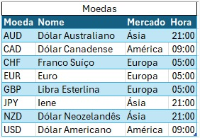

# Próximos Passos

## Implementação de Telas e Lógica

- [ ] **1. Login**
  - *Obs: Ainda não será utilizada neste momento.*

- [ ] **2. Tela Inicial**
  - Exibir usuário logado
  - **Funcionalidades:**
    1. Digitar pontos
    2. Análise

  - **2.1. Funcionalidade: Digitar Pontos**
    - Mostrar lista de instâncias da tabela `entradas_mercado`
    - **Colunas:** Data | Moeda | Editar | Excluir
    - **Ação Excluir:** Deve solicitar confirmação do usuário.
    - **Ação Editar:** Redirecionar para a tela de `DataForm` trazendo os campos já preenchidos.

  - **2.2. Funcionalidade: Análise**
    - Redirecionar para a Tela 3.

- [ ] **3. Tela de Análise**
  

---

## Banco de Dados e Backend

- [ ] **Realizar a Exclusão Lógica**
  - Adicionar atributo na tabela: `deletado` (tipo: *boolean*)
  - Alterar as consultas de visualização para mostrar apenas onde `deletado = false`

- [ ] **Alterar atributos da tabela de Moedas**
  

- [ ] **Alterar atributos da tabela `entradas_mercado`**
  - Adicionar campo: `data de alteração`

- [ ] **Infraestrutura**
  - Estudar implementação e distribuição do banco de dados.